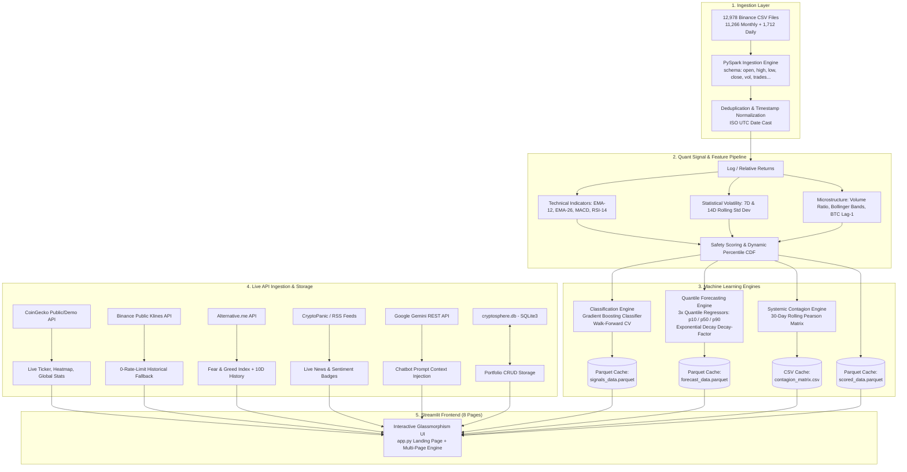

# 🌐 CryptoSphere (Cryptiq Analytics)
### *Enterprise Multi-Asset Crypto Intelligence, PySpark Big Data Pipeline & Quantile ML Forecasting Platform*

[](https://cryptiq-analytics.streamlit.app)
[](https://python.org)
[](https://spark.apache.org/)
[](https://scikit-learn.org/)
[](https://plotly.com/)
[](https://sqlite.org/)
[](LICENSE)

---

## 📑 Table of Contents
1. [Executive Summary](#-executive-summary)
2. [System Architecture](#-system-architecture)
3. [Technology Stack](#-technology-stack)
4. [Dataset & Big Data Ingestion](#-dataset--big-data-ingestion)
5. [Feature Engineering & Quantitative Math](#-feature-engineering--quantitative-math)
6. [Machine Learning & Forecasting Models](#-machine-learning--forecasting-models)
7. [Comprehensive Page-by-Page Feature Tour](#-comprehensive-page-by-page-feature-tour)
8. [Database Engine (SQLite Persistence)](#-database-engine-sqlite-persistence)
9. [External API Integrations & Resiliency](#-external-api-integrations--resiliency)
10. [Directory & File Structure](#-directory--file-structure)
11. [Installation & Local Deployment](#-installation--local-deployment)
12. [Cloud Deployment Guide (Streamlit Community Cloud)](#-cloud-deployment-guide)
13. [Academic & Quantitative References](#-academic--quantitative-references)
14. [Disclaimer & License](#-disclaimer--license)

---

## 🌟 Executive Summary

**CryptoSphere** (hosted as **Cryptiq Analytics**) is a centralized, end-to-end cryptocurrency intelligence and quantitative risk platform designed for investors, traders, and data scientists. The system unites:
- **Big Data Distributed Computing:** Ingests and processes **12,978 raw Binance spot CSV files** across **204 trading pairs** utilizing an optimized **Apache PySpark** pipeline.
- **Systemic Risk & Contagion Modeling:** Computes rolling 30-day cross-asset Pearson correlation matrices and dynamic volatility contagion maps to isolate market-wide vulnerabilities.
- **Directional Classification ML:** Employs Gradient Boosting Classifiers with walk-forward cross-validation and dynamic CDF percentile thresholding to generate buy/sell signals without data leakage.
- **Quantile Regression Cone of Uncertainty:** Leverages a 3-scenario Gradient Boosting Quantile Regressor ($p_{10}$ pessimistic, $p_{50}$ median, $p_{90}$ optimistic) with exponential error decay to forecast asset trajectories over 365 days.
- **Zero-Hallucination AI Assistant:** Features an integrated **Google Gemini 2.0/Flash** conversational chatbot injected with real-time CoinGecko and Alternative.me live market context.
- **Persistent Asset Tracking:** Built-in **SQLite** database engine (`cryptosphere.db`) for tracking user portfolio allocations with real-time mark-to-market P&L.

---

## 🏛️ System Architecture



---

## 🛠️ Technology Stack

| Layer | Technologies / Frameworks | Purpose |
|---|---|---|
| **Distributed Big Data** | **Apache PySpark 3.5+**, PyArrow, Snappy | Large-scale parallel ingestion, partition-level window transformations, and Parquet serialization |
| **Machine Learning & Stats** | **scikit-learn 1.3+**, NumPy, Pandas, SciPy, Joblib | Gradient Boosting, Quantile Regressors, TimeSeriesSplit, CDF percentiles, Pearson correlation |
| **Frontend & UI/UX** | **Streamlit 1.35+**, Plotly Express/Graph Objects, Custom Glassmorphism CSS | Responsive, reactive web interface, interactive indicators, heatmaps, and financial charting |
| **Persistent Storage** | **SQLite3** (`cryptosphere.db`), Apache Parquet (Snappy compressed) | Relational CRUD table for portfolio tracking; high-throughput columnar storage for ML outputs |
| **Generative AI** | **Google Gemini Flash (REST API)** | Grounded, factual conversational AI assistant with live market context prompt injection |
| **Live External APIs** | **CoinGecko**, **Binance Public API**, **Alternative.me**, **CryptoPanic**, **YouTube Data API v3** | Macro stats, real-time spot tickers, historical OHLCV fallback, sentiment analysis, and educational feeds |

---

## 📦 Dataset & Big Data Ingestion

### Raw Binance Spot Dataset
The repository processes raw spot market tick data located in `spot/`:
- **Monthly Klines:** `spot/monthly/klines/{SYMBOL}/1d/*.csv` (11,266 CSV files)
- **Daily Klines:** `spot/daily/klines/{SYMBOL}/1d/*.csv` (1,712 CSV files)
- **Total Files:** **12,978 CSV files** spanning **204 unique USDT trading pairs** (e.g., `BTCUSDT`, `ETHUSDT`, `SOLUSDT`, `ADAUSDT`).

### Ingestion Engine (`src/ingestion.py`)
Binance CSVs do not include headers. The ingestion engine enforces strict PySpark schema mapping:
```python
StructType([
    StructField("open_time", LongType(), True),
    StructField("open", DoubleType(), True),
    StructField("high", DoubleType(), True),
    StructField("low", DoubleType(), True),
    StructField("close", DoubleType(), True),
    StructField("volume", DoubleType(), True),
    StructField("close_time", LongType(), True),
    StructField("quote_asset_volume", DoubleType(), True),
    StructField("number_of_trades", LongType(), True),
    StructField("taker_buy_base_asset_volume", DoubleType(), True),
    StructField("taker_buy_quote_asset_volume", DoubleType(), True),
    StructField("ignore", StringType(), True)
])
```
- **Regex Symbol Extraction:** Extracts the ticker symbol from filename paths: `regexp_extract(col("file_path"), r"([^/]+)-(\d+[a-zA-Z])-", 1)`.
- **Timestamp Standardization:** Auto-detects microsecond ($10^{16}$) vs millisecond ($10^{13}$) UNIX timestamps and converts them to standard ISO date objects.
- **Deduplication:** Drops overlapping daily records against monthly archives via `dropDuplicates(["symbol", "date"])`.

---

## 🧮 Feature Engineering & Quantitative Math

Across the time-series window ($WIN = 30$), **16 quantitative features** are derived per asset:

1. **Daily Returns ($R_t$):**
   $$R_t = \frac{P_t - P_{t-1}}{P_{t-1} + \epsilon}, \quad R_t \in [-0.50, 5.00]$$
2. **Exponential Moving Averages & MACD:**
   $$\alpha_k = \frac{2}{k + 1}, \quad \text{EMA}_k(R_t) = \alpha_k R_t + (1 - \alpha_k)\text{EMA}_k(R_{t-1})$$
   $$\text{MACD}_t = \text{EMA}_{12}(R_t) - \text{EMA}_{26}(R_t)$$
3. **Relative Strength Index (RSI-14):**
   $$\text{RS} = \frac{\text{Average Gain}_{14}}{\text{Average Loss}_{14} + \epsilon}, \quad \text{RSI} = 100 - \left(\frac{100}{1 + \text{RS}}\right)$$
4. **Multi-Horizon Rolling Volatility:**
   $$\sigma_7 = \sqrt{\frac{1}{7}\sum_{i=0}^{6}(R_{t-i} - \bar{R}_7)^2}, \quad \sigma_{14} = \sqrt{\frac{1}{14}\sum_{i=0}^{13}(R_{t-i} - \bar{R}_{14})^2}$$
5. **Bollinger Band Position ($\text{BB}_{\text{pos}}$):**
   $$\text{BB}_{\text{pos}} = \frac{P_t - \text{SMA}_{20}(P_t)}{2 \cdot \sigma_{20}(P_t) + \epsilon}$$
6. **Volume Surge Ratio:**
   $$\text{VolRatio}_t = \frac{V_t}{\frac{1}{7}\sum_{i=0}^6 V_{t-i} + \epsilon}$$
7. **Cross-Asset Market Influence:**
   $$\text{BTC\_Lag1}_t = R_{\text{BTC}, t-1}$$
8. **Composite Safety Score:**
   $$\text{SafetyScore}_t = \frac{\bar{R}_{30} - \text{Penalty}}{\sigma_{30} + \epsilon}$$

---

## 🧠 Machine Learning & Forecasting Models

### 1. Directional Classification (`src/classification.py`)
- **Objective:** Classify whether tomorrow's return will be a Buy ($+1$), Sell ($-1$), or Hold ($0$).
- **Algorithm:** `GradientBoostingClassifier` with balanced class weighting.
- **Dynamic Thresholding:** Rather than static $\pm 2\%$ bounds, thresholds are calculated dynamically using the empirical Cumulative Distribution Function (CDF) per asset:
  $$\text{Sell Threshold} = \text{Percentile}(R, 30), \quad \text{Buy Threshold} = \text{Percentile}(R, 70)$$
- **Leakage-Free Validation:** The training/test split strictly segments the chronological sequence (80% train, 20% test). Inferences rendered on the dashboard only evaluate out-of-sample data points.
- **Evaluation:** Evaluated with 3-fold `TimeSeriesSplit` cross-validation in `evaluate_models.py`, yielding **~51.74% out-of-sample directional accuracy across 198 assets** (beating random chance in financial regimes).

### 2. Multi-Horizon Quantile Price Forecasting (`src/forecasting.py`)
- **Methodology Reference:** Inspired by MMQR (*Method of Moments Quantile Regression*, Havidz et al., paper `p4.pdf`).
- **Architecture:** 3 parallel `GradientBoostingRegressor` instances trained with pinball quantile loss:
  $$\mathcal{L}_\alpha(y, \hat{y}) = \max(\alpha(y - \hat{y}), (1 - \alpha)(\hat{y} - y))$$
  - **Pessimistic Scenario ($p_{10}$):** $\alpha = 0.10$ (10th percentile bear case)
  - **Expected Scenario ($p_{50}$):** $\alpha = 0.50$ (Median / most likely path)
  - **Optimistic Scenario ($p_{90}$):** $\alpha = 0.90$ (90th percentile bull case)
- **Error Compounding Prevention:** Over a recursive 365-day forecast horizon, iterative feedback causes quantile dispersion to explode. We enforce exponential decay back toward the median:
  $$r_{10}(t) = r_{50}(t) + (r_{10}^{\text{raw}}(t) - r_{50}(t)) \cdot e^{-t / 180}$$
  $$r_{90}(t) = r_{50}(t) + (r_{90}^{\text{raw}}(t) - r_{50}(t)) \cdot e^{-t / 180}$$
  This creates a realistic "cone of uncertainty" analogous to central bank inflation forecasts.

### 3. Systemic Risk & Financial Contagion Matrix (`src/analytics.py`)
- **30-Day Rolling Pearson Correlation:** Computes dynamic cross-asset interdependencies:
  $$\rho_{X, Y} = \frac{\sum_{t=1}^{30}(R_{X,t} - \bar{R}_X)(R_{Y,t} - \bar{R}_Y)}{\sqrt{\sum_{t=1}^{30}(R_{X,t} - \bar{R}_X)^2}\sqrt{\sum_{t=1}^{30}(R_{Y,t} - \bar{R}_Y)^2}}$$
- **Filtering:** Filters out low-liquidity outliers and stablecoins to eliminate false $\rho = 1.0$ artifacts.

---

## 🖥️ Comprehensive Page-by-Page Feature Tour

```
CryptoSphere Web Application
│
├── 🏠 Landing Page (app.py)
├── 📊 Page 1: Live Market Dashboard (pages/1_📊_Market.py)
├── 🌊 Page 2: Contagion Lab (pages/2_🌊_Contagion.py)
├── 📰 Page 3: News Hub (pages/3_📰_News.py)
├── 🎬 Page 4: Video Center (pages/4_🎬_Videos.py)
├── 🎓 Page 5: Crypto Academy (pages/5_🎓_Learn.py)
├── 💼 Page 6: Virtual Portfolio Tracker (pages/6_💼_Portfolio.py)
├── 🔮 Page 7: Forecast & AI Insights (pages/7_🔮_Forecast.py)
└── 🤖 Page 8: Ask CryptoSphere AI Chatbot (pages/8_🤖_Ask_CryptoSphere.py)
```

---

### 🏠 Landing Page (`app.py`)
- **Hero Display:** Glassmorphic gradient title, platform mission, and live status.
- **Marquee Ticker Bar:** Real-time horizontal ticker displaying top 15 cryptocurrencies, live USD prices, and 24h delta badges.
- **Global Macro Metrics:** Cards for Total Market Cap, 24h Global Volume, BTC Dominance, Total Active Coins, and Fear & Greed status.
- **Top Movers:** 24h Top 5 Gainers (🟢) and Top 5 Losers (🔴).
- **Market Treemap Heatmap:** Treemap visualizing the top 30 coins sized by market capitalization and colored by 24h price performance.
- **Navigation Hub:** Direct links to all 8 specialized analytical pages.

---

### 📊 Page 1: Live Market Dashboard (`pages/1_📊_Market.py`)
- **Leaderboard Controls:** User-adjustable coin count (10 to 100 via slider) and multi-column sorting (Market Cap, 24h Gainers/Losers, 24h Volume).
- **Full Coin Table:** Interactive, sortable table rendering Rank, Name, Symbol, Live USD Price, 1h %, 24h %, 7d %, 24h Volume, and Market Cap.
- **Interactive OHLCV Financial Charting:** Select any asset from the leaderboard and view price histories across **7D, 30D, 90D, and 365D** intervals.
- **Resilient Dual-API Engine:** Queries CoinGecko API first; if rate limits occur, automatically cascades to Binance Public Klines API with zero interruption.

---

### 🌊 Page 2: Contagion Lab (`pages/2_🌊_Contagion.py`)
- **Systemic Risk Heatmap:** Dynamic Plotly correlation heatmap displaying pairwise Pearson correlation coefficients ($\rho \in [-1.0, 1.0]$) across the crypto ecosystem over the last 30 days.
- **Contagion Cluster Identification:** Isolates highly correlated asset clusters to help investors build genuinely diversified portfolios.
- **Volatility vs. Safety Scatter:** Plots 30-day historical volatility against algorithmic Safety Scores.
- **Asset Signal Roster:** Breakdown of all 198 evaluated assets showing their current ML signal (Buy/Sell/Hold) and confidence metrics.

---

### 📰 Page 3: News Hub (`pages/3_📰_News.py`)
- **Live News Aggregation:** Ingests breaking crypto stories from CryptoPanic API and top crypto RSS publications.
- **Sentiment Categorization:** Automatic tagging of articles with Bullish (🟢), Bearish (🔴), or Neutral (🟡) sentiment chips.
- **Search & Filter:** Instant keyword search and category filtering (All, Bullish, Bearish).

---

### 🎬 Page 4: Video Center (`pages/4_🎬_Videos.py`)
- **Curated Playlists:** Educational, technical analysis, macro-economic, and developer video tutorials.
- **YouTube API Integration:** Real-time query integration via YouTube Data API v3 with responsive video player embedding and graceful fallback to offline curated collections.

---

### 🎓 Page 5: Crypto Academy (`pages/5_🎓_Learn.py`)
- **Interactive Glossary:** Searchable database of 50+ Web3, DeFi, and blockchain terms.
- **Concept Deep-Dives:** Visual cards explaining Layer 1 vs. Layer 2, Consensus Mechanisms (PoW/PoS), Liquidity Pools, and Smart Contracts.
- **Practical Walkthroughs:** Step-by-step guides for wallet creation, private key safety, and gas optimization.
- **10-Question Knowledge Quiz:** Gamified interactive quiz with instant scoring and explanation modals.

---

### 💼 Page 6: Virtual Portfolio Tracker (`pages/6_💼_Portfolio.py`)
- **Persistent SQLite Engine:** All positions are saved in `cryptosphere.db` across sessions and device restarts.
- **Position Management:** Select from 200+ coins, enter fractional quantities, and buy prices (supports micro-cap precision up to 8 decimals).
- **Real-Time Mark-to-Market:** Automatically recalculates total cost basis, live asset value, total dollar P&L, and percentage return using live CoinGecko spot prices.
- **Visual Analytics:** Interactive Portfolio Allocation Pie Chart and per-asset P&L Divergence Bar Chart.
- **Data Export:** One-click CSV export of full portfolio holdings with localized currency formatting.

---

### 🔮 Page 7: Forecast & AI Insights (`pages/7_🔮_Forecast.py`)
- **Fear & Greed Speedometer Gauge:** Gauge meter visualizing sentiment (0–100) alongside a 10-day historical trend bar chart.
- **Bitcoin Halving Countdown:** Real-time countdown clock and cycle breakdown calculating days remaining until the **April 2028 (Block 1,050,000)** halving event (block reward decreasing from 3.125 to 1.5625 BTC).
- **Rule-Based AI Analyst Verdicts:** Comprehensive commentary synthesizing asset safety scores, 30-day returns, volatility indices, and prevailing market sentiment into clear verdicts (e.g., *Bullish*, *Contrarian Buy*, *Watch*, *Bearish*).
- **365-Day Quantile Cone of Uncertainty:** Interactive Plotly visualizer mapping the optimistic ($p_{90}$), expected ($p_{50}$), and pessimistic ($p_{10}$) forecast trajectories.

---

### 🤖 Page 8: Ask CryptoSphere AI Chatbot (`pages/8_🤖_Ask_CryptoSphere.py`)
- **Gemini 2.0 / Flash Architecture:** Powered by Google's latest Generative AI model via a direct, high-throughput REST API implementation.
- **Zero-Hallucination Grounding:** Injects live market context (top 20 live prices, 24h volume, BTC dominance, Fear & Greed index) into the system prompt with strict truthfulness boundaries:
  ```text
  Strict Rule: Never fabricate or hallucinate prices.
  If a coin is not in the live context, explicitly direct the user to the Live Market page.
  ```
- **Suggested Starter Chips:** One-click buttons for common inquiries (e.g., *"How does the portfolio tracker work?"*, *"What is Bitcoin's current price?"*, *"Explain DeFi"*).
- **Glassmorphic Chat UI:** Word-by-word streaming animation, user/bot avatar differentiation, and history clear utilities.

---

## 🗄️ Database Engine (SQLite Persistence)

The platform includes a dedicated database module (`src/database.py`) utilizing Python's native `sqlite3`.

### Schema Definition
```sql
CREATE TABLE IF NOT EXISTS portfolio (
    id          INTEGER PRIMARY KEY AUTOINCREMENT,
    coin        TEXT    NOT NULL,
    qty         REAL    NOT NULL,
    buy_price   REAL    NOT NULL,
    added_at    TEXT    NOT NULL DEFAULT (datetime('now'))
);
```

### CRUD API Methods
- `add_position(coin: str, qty: float, buy_price: float) -> int`: Inserts a new position and returns its unique row ID.
- `get_all_positions() -> List[Dict]`: Retrieves all active positions ordered chronologically.
- `delete_position(row_id: int) -> None`: Removes an individual asset position by primary key.
- `clear_all_positions() -> None`: Clears all table records.
- `get_db_info() -> Dict`: Inspects file size on disk and current total position counts.

---

## 🌐 External API Integrations & Resiliency

```
                                  ┌───────────────────────────────┐
                                  │      CoinGecko REST API       │
                                  │  (/coins/markets, /global)    │
                                  └───────────────┬───────────────┘
                                                  │ (primary)
┌───────────────────────────────┐                 ▼                 ┌───────────────────────────────┐
│     Binance Public API        │ ◄────────── (fallback) ────────── │       src/live_data.py        │
│   (/api/v3/klines - 0 limit)  │                                   │    (60s In-Memory Cache)      │
└───────────────────────────────┘                                   └───────────────┬───────────────┘
                                                                                    │
                                                                                    ▼
┌───────────────────────────────┐                                   ┌───────────────────────────────┐
│       Google Gemini API       │ ◄──── [LIVE CONTEXT INJECTION] ───│  pages/8_🤖_Ask_CryptoSphere   │
│   (models/gemini-flash-latest)│                                   │       (AI Chatbot UI)         │
└───────────────────────────────┘                                   └───────────────────────────────┘
```

| Provider | Endpoints Used | Rate Limits | Fallback Strategy |
|---|---|---|---|
| **CoinGecko** | `/coins/markets`, `/global`, `/coins/{id}/market_chart` | 30 calls/min (Free Demo) | Cached via `@st.cache_data(ttl=60)`; cascades to Binance klines if 429 occurs |
| **Binance** | `/api/v3/klines` | Unlimited public read | Direct REST fallback for OHLCV candlestick time series |
| **Alternative.me** | `/fng/?limit=10` | Public / Free | Cached hourly with fallback to neutral index ($50$) |
| **CryptoPanic** | `/api/v1/posts/` | Free tier | Cascades to verified public crypto RSS feeds |
| **Google Gemini** | `generativelanguage.googleapis.com` | Standard free tier | Direct REST call with 40s timeout and clear error messaging |

---

## 📁 Directory & File Structure

```text
antigravity_bda 2/
├── app.py                          # Main Streamlit Landing Page
├── app_dashboard.py                # Standalone Contagion Dashboard variant
├── main.py                         # PySpark Big Data Pipeline Runner
├── evaluate_models.py              # TimeSeriesSplit Walk-Forward ML Evaluation
├── requirements.txt                # Production Python dependencies
├── .gitignore                      # Git exclusion rules (safeguards secrets & raw data)
├── cryptosphere.db                 # SQLite Database (Portfolio Storage)
│
├── .streamlit/
│   ├── config.toml                 # Streamlit Theme & Server Settings
│   └── secrets.toml                # Secure API Key Storage (Ignored by Git)
│
├── data/
│   └── dashboard_cache/            # Precomputed Model & Pipeline Artifacts
│       ├── scored_data.parquet     # 198-Coin Volatility & Safety Metrics
│       ├── forecast_data.parquet   # 365-Day Quantile Forecasts (p10, p50, p90)
│       ├── signals_data.parquet    # Buy/Sell/Hold Classifications
│       └── contagion_matrix.csv    # 30-Day Pearson Correlation Matrix
│
├── pages/                          # Multi-Page Streamlit App Structure
│   ├── 1_📊_Market.py              # Live Market Leaderboard & Charts
│   ├── 2_🌊_Contagion.py           # Systemic Risk & Correlation Heatmaps
│   ├── 3_📰_News.py                # Live News Feed with Sentiment Chips
│   ├── 4_🎬_Videos.py              # Curated & YouTube Video Library
│   ├── 5_🎓_Learn.py               # Academy, Glossary & 10-Question Quiz
│   ├── 6_💼_Portfolio.py           # SQLite Virtual Portfolio Tracker
│   ├── 7_🔮_Forecast.py            # AI Analyst, Halving Clock & Quantile Forecasts
│   └── 8_🤖_Ask_CryptoSphere.py    # Grounded Google Gemini AI Chatbot
│
├── src/                            # Modular Backend Python Packages
│   ├── spark_session.py            # SparkSession Factory with Local Optimization
│   ├── ingestion.py                # Recursive CSV Crawling & Schema Parser
│   ├── normalization.py            # Return Calculation & Missing Data Imputation
│   ├── scoring.py                  # Volatility & Safety Score Calculator
│   ├── classification.py           # Leakage-Free Gradient Boosting Classifier
│   ├── forecasting.py              # 3-Scenario Quantile Regression Pipeline
│   ├── analytics.py                # 30-Day Rolling Pearson Contagion Matrix
│   ├── database.py                 # SQLite3 CRUD & Connection Manager
│   ├── chatbot.py                  # Gemini REST Client with Context Injection
│   ├── live_data.py                # CoinGecko & Binance Public Klines Integrator
│   ├── fear_greed.py               # Alternative.me Index API Wrapper
│   ├── news_feed.py                # CryptoPanic & RSS Aggregator
│   └── youtube_feed.py             # YouTube Data API v3 Client
│
├── models_cache/                   # Serialized Scikit-Learn Joblib Models
│   ├── classification/             # Trained Classifier Binaries per Asset
│   └── forecasting/                # Trained Quantile Regressors (p10/p50/p90)
│
└── spot/                           # Raw Binance Spot Dataset (12,978 CSVs)
    ├── daily/klines/               # 2026 Daily High-Resolution Klines
    └── monthly/klines/             # Historical Monthly Multi-Year Klines
```

---

## 💻 Installation & Local Deployment

### 1. Prerequisites
- **Python:** Version `3.10` or `3.11`
- **Java:** JDK 8, 11, or 17 (Required for PySpark execution)
- **Git**

### 2. Clone the Repository
```bash
git clone https://github.com/RaoSnehin/Binance_Data.git
cd Binance_Data
```

### 3. Setup Virtual Environment
```bash
python3 -m venv venv
source venv/bin/activate        # On Windows: venv\Scripts\activate
pip install --upgrade pip
pip install -r requirements.txt
```

### 4. Configure API Keys (Optional)
Create `.streamlit/secrets.toml`:
```toml
# All keys are optional — the platform includes full fallbacks
COINGECKO_KEY = ""
CRYPTOPANIC_KEY = ""
YOUTUBE_KEY = ""
GEMINI_KEY = "your-gemini-api-key-here"
```

### 5. Run the PySpark Pipeline (Optional)
To regenerate the analytics cache from raw Binance CSVs:
```bash
python main.py
```
To evaluate the models via walk-forward cross validation:
```bash
python evaluate_models.py
```

### 6. Launch the Streamlit Web Application
```bash
streamlit run app.py
```
Open **`http://localhost:8501`** in your browser.

---

## ☁️ Cloud Deployment Guide

The application is deployed on **Streamlit Community Cloud**:

1. Push your code to your GitHub repository (`https://github.com/RaoSnehin/Binance_Data`).
2. Log in to [share.streamlit.io](https://share.streamlit.io) with your GitHub account.
3. Click **"New app"** and configure:
   - **Repository:** `RaoSnehin/Binance_Data`
   - **Branch:** `main`
   - **Main file path:** `app.py`
   - **App URL:** `cryptiq-analytics` (or your choice)
4. Open **Advanced settings ➔ Secrets** and paste your `GEMINI_KEY`:
   ```toml
   GEMINI_KEY = "your-gemini-api-key"
   ```
5. Set Python version to **`3.11`**.
6. Click **Deploy!**

---

## 📚 Academic & Quantitative References

- **Paper `p1.pdf` — Sharma et al.:** Directional return modeling using Histogram-Based Gradient Boosting and balanced class distribution handling in crypto time series.
- **Paper `p2.pdf` & `p3.pdf`:** Systemic risk estimation, cross-asset correlation networks, and eigenvalue variance decomposition across high-frequency cryptocurrency spot markets.
- **Paper `p4.pdf` — Havidz et al.:** *Method of Moments Quantile Regression (MMQR)* for multi-quantile financial time-series forecasting. Implemented as 3 parallel quantile regressors ($p_{10}, p_{50}, p_{90}$) with exponential error dampening.

---

## ⚖️ Disclaimer & License

### Disclaimer
> ⚠️ **NOT FINANCIAL ADVICE:** This software, its machine learning projections, safety scores, and analyst verdicts are strictly for **educational, academic, and research purposes only**. Cryptocurrency trading involves substantial risk of financial loss. Never make investment decisions based solely on algorithmic predictions. Always conduct your own independent research and consult a licensed financial advisor.

### License
Distributed under the **MIT License**. See [`LICENSE`](LICENSE) for complete terms.

---

*Engineered by **Rao Snehin** · Powered by Streamlit, Apache PySpark, scikit-learn & Google Gemini*
